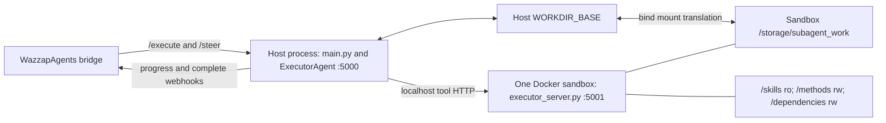

# WazzapSubAgents — Architecture

WazzapSubAgents is a small **host service with one Docker tool sandbox** that
runs autonomous agents ("sub-agents") on behalf of a parent orchestrator
(typically the [WazzapAgents] bridge). A sub-agent is given
a free-form instruction plus some input files, and is free to run arbitrary
`bash`, `python`, or `javascript` code inside the sandbox until it decides the
task is done — at which point it calls `end_task(...)` with a report and a list
of deliverable files.

This document explains how the whole thing fits together so you can touch any
layer with confidence.

[WazzapAgents]: https://github.com/Chomosuke9/WazzapAgents

---

## 1. High-level topology



There is exactly **one container**. The API and LLM loop run directly on the
host; only generated tool code crosses into Docker.

### Host service — main Flask API (`main.py` and `src/app.py`, port 5000)

- Receives `/execute` requests from WazzapAgents.
- Manages sessions, workdirs, and the FIFO queue.
- Runs the **LLM agent loop** (`src/agent.py`) in a background thread.
- Builds, starts, health-checks, and replaces the local sandbox through
  `DockerManager`.
- Forwards every tool call the LLM makes to the sandbox over loopback HTTP.
- Fires `progress` / `complete` webhooks back to the bridge.

### Docker sandbox — `executor-executor` (`src/executor_server.py`, port 5001)

- Pure dumb executor: receives `/bash`, `/python`, `/javascript` POSTs, runs the
  code with `cwd = <session workdir>`, returns `{stdout, stderr, returncode}`.
- Has the document-processing toolchain installed (see
  [Dockerfile](./Dockerfile): poppler-utils, tesseract, libreoffice, qpdf,
  ghostscript, reportlab, python-docx, python-pptx, openpyxl, pandas,
  pptxgenjs, docx, pdf-lib, …).
- Mounts `./skills/` **read-only** at `/skills/` so agents can read
  `SKILL.md` files at runtime.
- Mounts `./methods/` **read-write** at `/methods/` so validated procedures can
  persist across otherwise ephemeral sessions.
- Mounts `./dependencies/` **read-write** at `/dependencies/` so lightweight
  user-space libraries and executables can be reused by later sessions.

This split is deliberate: the trusted host service talks to the LLM and parent
bridge, while the sandbox is the only process that executes generated code.
The private workdir limits ordinary task files, but `/methods` and
`/dependencies` are explicit shared persistence boundaries and must be treated
as trusted code.

---

## 2. Request lifecycle

The entry point is `POST /execute` on the main service (`execute()` in `src/app.py`):

1. **Validate** `session_id` + `instruction`. `session_id` is sanitised so it
   can't traverse outside `WORKDIR_BASE` when used as a directory name
   (`SessionManager.get_or_create()` in `src/session_manager.py`, mirrored in `_resolve_workdir()` in `src/executor_server.py`).
2. **Get or create a session.** Each session gets:
   - a dedicated workdir at `${WORKDIR_BASE}/<session_id>/`;
   - a `Session` object tracking `last_activity`, `status`, `result`,
     `callback_url`, `progress_webhook`, `progress_logs`
     (`Session` dataclass in `src/session_manager.py`).
3. **Stage input files.** Whatever paths the bridge passed in `input_files` are
   **copied** into `<workdir>/input/<basename>`
   (`src/input_staging.py`). This is the single fix for a whole class of
   cross-process "file not found" bugs: the sandbox only bind-mounts
   `${WORKDIR_BASE}`, so inputs staged outside it would be invisible.
4. **Enqueue / acquire a slot** in the global `SubAgentQueue`
   (`src/concurrency.py`). At most `SUBAGENT_GLOBAL_LIMIT` (default **1**)
   agents run concurrently; further sessions block in FIFO order. While
   waiting, the queue fires `queued` / `queue_advanced` events via the
   session's `progress_webhook`.
5. **Return `202 processing` immediately.** The agent loop runs in a daemon
   thread so the HTTP request doesn't have to stay open for the whole task.

When the agent loop finishes:

6. **Store the result** on the `Session` and fire a `complete` webhook to the
   bridge's `callback_url` (if any).
7. The result is also readable at `GET /sessions/<session_id>/result`.

Sessions that have been `completed` and idle for more than
`SESSION_IDLE_TIMEOUT` seconds (default 7200) are cleaned up by a background
thread (`SessionManager._cleanup_loop()` in `src/session_manager.py`) — the workdir is deleted with
`shutil.rmtree`.

---

## 3. Agent loop (ReAct with native tool calls)

`ExecutorAgent.execute` (`src/agent.py`) is a standard **ReAct** loop built on
LangChain's `ChatOpenAI.bind_tools(...)`. Four tools are exposed to the model:

| Tool         | Args                                      | What it does |
|--------------|-------------------------------------------|--------------|
| `bash`       | `reason`, `command`                       | `POST /bash` → sandbox runs `sh -c command` in workdir |
| `python`     | `reason`, `code`                          | `POST /python` → sandbox runs a private UID-owned script with Python |
| `javascript` | `reason`, `code`                          | `POST /javascript` → sandbox runs a private UID-owned script with Node.js |
| `end_task`   | `success`, `report`, `output_files?`      | Exits the loop with a final report + deliverable paths |

Each turn:

1. The main service calls the LLM with the running conversation.
2. The model must emit exactly one native `tool_call` (plain-text replies are
   counted and, after `AGENT_NO_TOOL_RETRY_MAX` attempts, the agent gives up).
3. `_dispatch_tool` runs the tool against the sandbox and appends the output
   back into the conversation as a `ToolMessage`.
4. A `progress` event (with the `reason`) is fired to the bridge so the end
   user can see what the agent is doing (`SessionManager.append_progress`).
5. Loop until the model calls `end_task`.

The loop also has guard-rails:

- **LLM retry with backoff** on rate-limits / 5xx / network errors
  (`_is_retryable_llm_error`, `_retry_after_seconds` honours `Retry-After`).
- **Stuck-loop detector** — if the agent fires the same tool call signature
  `AGENT_STUCK_LOOP_THRESHOLD` (default 5) times in a row, it is force-stopped.
- **Schema contract** — every tool requires a `reason` field so the progress
  webhook always has something human-readable to surface in WhatsApp.

The system prompt constructed by `_build_system_prompt`
(`src/agent.py`) tells the model:

- where `/skills/` lives and how to read it;
- to inspect `/methods/` before using a skill or trying task-specific variants;
- to save one reusable method only after a fallback route has objectively
  succeeded, never after failure or partial completion;
- that input files are already staged at the listed paths — don't search the
  filesystem;
- to write output anywhere in the workdir;
- to only list final **deliverable** files in `end_task(output_files=[...])` —
  not scratch or intermediate files.
- that mid-task steering instructions may arrive and must be treated as
  higher-priority directives that override the original instruction.

---

## 3a. Steering — mid-task course correction

A parent orchestrator can **steer** a running sub-agent by sending
`POST /steer` with `{session_id, instruction}`. This is useful when the
user refines their request while the agent is already executing (e.g.
"Cari gambar kucing" instead of "Cari gambar binatang").

### How it works

1. The parent calls `POST /steer` with a new instruction.
2. `SessionManager.add_steering_message()` appends the instruction to
   `session.steering_messages` (a simple list protected by the session
   lock) and fires a `steering` progress webhook.
3. On the **next iteration** of the agent loop (after the current tool
   call finishes, before the next LLM invocation),
   `SessionManager.consume_steering_messages()` drains the list and
   returns all pending messages.
4. Each steering message is injected into the conversation as a
   `HumanMessage` prefixed with `[STEERING INSTRUCTION]:` so the LLM
   recognises it as a new user directive.
5. The agent continues the loop with the updated conversation,
   adjusting its behaviour to the refined instruction.

This is *not* a hard interrupt — a steering message takes effect only
between agent-loop iterations, not mid-LLM-call or mid-tool-execution.
The design is intentionally simple: no threading events, no
cancellation tokens, just a list that the loop polls.

### API

```
POST /steer
Content-Type: application/json

{
  "session_id": "abc123",
  "instruction": "Instead of searching for animal images, search specifically for cat images."
}
```

Returns `200` with `{success: true}` if the session is active and the
message was queued, or `404` if the session does not exist or is not
active.

When `end_task` fires, `_resolve_declared_output_files`
(`src/agent.py`) validates the declared paths: each must (a) exist as
a regular file and (b) live strictly inside the workdir. Anything else is
dropped with a logged warning.

---

## 4. File-sharing contract

The bridge can use authenticated uploads/downloads and does not need to share a
filesystem with this service. Only the host service and sandbox share session
workdirs.

### The shared-host-path rule

`WORKDIR_BASE` defaults to `<repo>/.runtime/subagent_work` on the host. It must:

1. Exist on the host.
2. Be bind-mounted by `DockerManager` to the fixed
   `/storage/subagent_work` path inside the sandbox.
3. Remain writable by the host service so it can stage inputs and deliver
   outputs.

The host and sandbox paths intentionally differ. This translation makes the
single runtime layout work with both Windows drive paths and normal Linux paths.
Inside each root, the sanitized `session_id` suffix is identical.

### Per-session layout

```
${WORKDIR_BASE}/
└── <session_id>/            ← sanitised, can't traverse
    ├── input/               ← staged by input_staging.py
    │   ├── contract.pdf
    │   └── logo.png
    ├── report.pdf           ← agent-produced
    └── invoice.docx         ← agent-produced (declared in end_task)
```

- `<session_id>/input/` is populated by the **host service** before the agent
  starts; the sandbox reads the bind-mounted copy.
- Anything else the agent writes lands in `<session_id>/` directly (that is
  the `cwd` the sandbox hands to `subprocess.run`). Use relative paths like
  `./report.pdf`.
- The agent declares which files are deliverables via
  `end_task(output_files=[...])`. Those paths are validated, deduped, and
  returned to the bridge as **absolute host paths** so the bridge can hand
  them to the WhatsApp media upload step.
- On session cleanup (idle timeout), the whole `<session_id>/` subtree is
  `rmtree`'d. **Do not rely on workdirs surviving past the session.**

### Absolute paths to avoid

These directories do **not** exist in the sandbox and will silently make
output invisible to the bridge — check your skill docs and prompts for them:

- `/output/` — legacy Anthropic-style path, leftover from upstream templates.
- `/mnt/user-data/outputs/` — also legacy; not mounted anywhere.
- `/tmp/` — exists but is not bind-mounted, so the bridge cannot read it.

Always write to the current working directory (`.`) or an explicit workdir
path.

---

## 5. Methods-first learning and skill fallback

### Reusable methods

`./methods/` is a deliberately small procedural-memory POC. It is mounted at
`/methods/` read-write; it is not copied into the image and is not nested under
an ephemeral session workdir. A method learned by one session therefore appears
immediately in the repository and is available to the next session.

The prompt enforces this state transition:

```text
inspect /methods
  -> matching method: execute + validate -> end_task
  -> no/stale method: read relevant /skills docs -> discover procedure
       -> validated success: atomically create/update one method -> end_task
       -> failure/partial result: do not write a method -> end_task(false)
```

The same tree appears inside the sandbox at
`/storage/subagent_work/<session_id>/`.

Methods are regular top-level `.md` or `.txt` files. They contain applicability,
prerequisites, parameterized steps/commands, and objective validation checks.
Task-specific values, secrets, personal data, user content, and instructions
copied from untrusted web pages are forbidden.

The sandbox runs each session as a different Unix UID with `umask 077`. To keep
method files genuinely shared, `src/executor_server.py` recognizes only a
directory containing the exact `.methods-root` marker, makes that directory
shared-writable, and normalizes top-level method documents after every executed
tool call. It does not change workdir permissions. This POC is globally shared
and not tenant-isolated, so all subagents can alter the same trusted procedure
set.

### Persistent dependencies

`./dependencies/` is mounted read-write only into the sandbox and is
not copied into the image. The executor creates four runtime roots:

| Path | Runtime wiring |
|------|----------------|
| `/dependencies/python` | `PYTHONPATH` and `PIP_TARGET` |
| `/dependencies/node/node_modules` | `NODE_PATH` |
| `/dependencies/bin` | prepended to `PATH` |
| `/dependencies/cache` | pip/npm caches |

Python and Node package-script directories are also prepended to `PATH`.
Generated commands may install only lightweight user-space dependencies here;
system package managers and writes to the image's Python/Node installations
remain forbidden. The prompt requires pinned versions, a fresh validation
command, and recording the dependency in the successful method.

Like methods, dependencies are shared across isolated UIDs. A marker check,
recursive permission repair, and inherited POSIX ACLs make existing and newly
created files reusable. Suspected dependency-mutating commands are serialized
inside the executor. Package contents persist on the host but are ignored by
Git. Native extensions may become stale after a Python, Node, OS, or image ABI
upgrade and should then be removed and reinstalled.

### Skill fallback

`./skills/` is a curated directory of **LLM-consumable reference
documentation** for common document-processing tasks. `DockerManager` mounts it
**read-only** into the sandbox at `/skills/`. The directory is not copied into
the image.

For every new task, the current concise table in `skills/README.md` is injected
into the system prompt. It is read from the live mount without a process-wide
cache, so repository edits do not require an image rebuild or service restart.
The model is then told to read only the relevant local `SKILL.md`:

> The catalog is already available in this prompt. If a relevant skill exists,
> read its `/skills/<name>/SKILL.md` before acting.

### Layout

```
skills/
├── canvas-design/           ← poster / art rendering
│   ├── SKILL.md
│   └── canvas-fonts/        ← TTF fonts loaded by reportlab/Pillow
├── 9router/                 ← setup + local capability index
│   ├── 9router-chat/        ← OpenAI/Anthropic-compatible chat
│   ├── 9router-image/       ← image generation
│   ├── 9router-video/       ← async video generation
│   ├── 9router-tts/         ← text-to-speech
│   ├── 9router-stt/         ← speech-to-text
│   ├── 9router-embeddings/  ← vector embeddings
│   ├── 9router-web-search/  ← web search
│   └── 9router-web-fetch/   ← URL extraction
├── docx/
│   └── SKILL.md             ← single big doc (Node.js docx + python-docx)
├── pdf/
│   ├── SKILL.md             ← entry point + quick decision tree
│   ├── creation.md          ← reportlab / pdf-lib
│   ├── editing.md           ← pypdf, qpdf, reportlab overlays
│   ├── extraction.md        ← pdfplumber, pypdf, OCR (tesseract)
│   └── transformation.md    ← merge / split / rotate / watermark
├── pptx/
│   ├── SKILL.md
│   ├── creation.md          ← pptxgenjs (Node.js)
│   ├── editing.md           ← python-pptx
│   └── extraction.md        ← python-pptx + markitdown
└── xlsx/
    └── SKILL.md             ← openpyxl + pandas
```

### Skill authoring rules

1. **Every snippet must be runnable as-is** inside the sandbox. The sandbox's
   cwd *is* the workdir; use relative paths (`./invoice.docx`). Never write
   `/output/...` or `/mnt/user-data/...`.
2. **Pick libraries we actually ship** (see Dockerfile). Don't reference
   PyMuPDF/fitz — we use pypdf.
3. **SKILL.md is the entry point**; split into sub-docs only when a skill is
   too large to fit in one LLM context window. The agent reads SKILL.md
   first.
4. **No Anthropic/Claude template leakage** — this project runs on
   OpenAI-compatible models via LangChain. Refer to "the agent", not "the
   next Claude".
5. **Declare only deliverables** — every skill's "Best Practices" section
   must remind the agent to exclude scratch files from
   `end_task(output_files=[...])`.

---

## 6. Concurrency, resilience, and webhooks

### Global FIFO gate

`SubAgentQueue` (`src/concurrency.py`) is a `threading.Condition`-backed
FIFO queue that caps concurrent agent executions to `SUBAGENT_GLOBAL_LIMIT`
(default **1**). Keeping it at 1 means:

- Only one LLM call-chain is in flight at a time — cheap and predictable
  cost-wise.
- Only one sandbox code execution at a time — the global FIFO gate
  already serialises Python stdout/stderr hijacking anyway.

While queued, the session receives `queued` and `queue_advanced` webhook
events so the bridge can tell the user "you're #3 in line".

### Webhook reliability

`SessionManager._fire_webhook` retries with exponential backoff up to
`WEBHOOK_RETRY_MAX` (default 15) times, capped at `WEBHOOK_RETRY_MAX_BACKOFF`
seconds. All webhooks are fired on a daemon thread so the agent loop never
blocks on the bridge.

### LLM resilience

Tunables (all env-overridable):

- `AGENT_MAX_ITERATIONS=50` — max ReAct turns per task; `0` disables the cap.
- `AGENT_LLM_RETRY_MAX=5` — retries on 429 / 5xx / timeout / connection.
- `AGENT_LLM_RETRY_BASE_BACKOFF=2.0`, `AGENT_LLM_RETRY_MAX_BACKOFF=60.0`.
- `AGENT_STUCK_LOOP_THRESHOLD=5` — max repeated identical tool calls before
  aborting.
- `AGENT_NO_TOOL_RETRY_MAX=3` — max plain-text replies before aborting.

### Session cleanup

Completed sessions older than `SESSION_IDLE_TIMEOUT` (default 7200 s) are
deleted every 10 s by a daemon thread. The workdir is `rmtree`'d on cleanup —
**outputs must be collected by the bridge before then** (the `complete`
webhook is fired as soon as the result is stored, so this is a
non-issue in practice).

---

## 7. Deployment layout

There is one supported layout:

- Run `python main.py` on the host.
- `DockerManager` connects through Docker's platform-default endpoint, builds
  `executor-service:v1.0.0`, and owns one container named
  `executor-executor`.
- The sandbox source is baked into the image. A source fingerprint rebuilds and
  replaces a stale sandbox automatically; `src/` and `main.py` are not runtime
  mounts.
- The host `WORKDIR_BASE` is mounted read-write at the fixed sandbox path
  `/storage/subagent_work`.
- `./methods` and `./dependencies` are mounted read-write; `./skills` is mounted
  read-only.
- The host service talks only to `127.0.0.1:${EXECUTOR_PORT}`. There is no
  external-executor switch and no two-container Compose layout.
- WazzapAgents may be on another machine because authenticated input upload and
  output download do not require a shared filesystem.

---

## 8. Environment variables (cheat sheet)

System config (including `LLM_API_KEY`) lives in `.env`. All skill-specific
values, including `NINEROUTER_URL`, live in `.env.secrets` (git-ignored). The host loads
both files, but the sandbox receives only explicitly allowlisted skill config.
Never put `LLM_API_KEY` in `.env.secrets`, because the sandbox runs arbitrary
bash/python/js generated by the LLM.

### Config (`.env`)

| Variable                      | Default                        | Purpose |
|-------------------------------|--------------------------------|---------|
| `LLM_API_KEY`                 | **required**                   | API key for the OpenAI-compatible endpoint |
| `AGENT_MODEL`                 | **required**                   | Model identifier (e.g. `gpt-4o-mini`, or whatever the proxy exposes) |
| `LLM_BASE_URL`                | unset (→ OpenAI default)       | Custom OpenAI-compatible endpoint |
| `AGENT_TEMPERATURE`           | `0.7`                          | LLM sampling temperature |
| `FLASK_PORT`                  | `5000`                         | Host API listen port |
| `EXECUTOR_PORT`               | `5001`                         | Localhost port published by the sandbox |
| `EXECUTOR_HTTP_TIMEOUT_GRACE` | `15`                           | HTTP response grace after tool timeout |
| `EXECUTOR_API_TOKEN`          | unset                          | Bearer credential for host → sandbox tool calls |
| `EXECUTOR_REQUIRE_AUTH`       | `1`                            | Fail closed when the token is absent |
| `WORKDIR_BASE`                | `<repo>/.runtime/subagent_work` | Host workdir root translated to `/storage/subagent_work` in Docker |
| `SUBAGENT_STORAGE_DIR`        | parent of workdir              | Optional host root accepted for shared input paths |
| `SESSION_IDLE_TIMEOUT`        | `7200`                         | Seconds before a completed session's workdir is deleted |
| `SUBAGENT_GLOBAL_LIMIT`       | `1`                            | Max concurrent agent executions |
| `AGENT_MAX_ITERATIONS`        | `50`                           | Max ReAct turns per task; `0` means unlimited |
| `AGENT_LLM_RETRY_MAX`         | `5`                            | LLM call retry budget |
| `AGENT_STUCK_LOOP_THRESHOLD`  | `5`                            | Max identical tool calls before aborting |
| `AGENT_NO_TOOL_RETRY_MAX`     | `3`                            | Max plain-text replies before aborting |
| `AGENT_TOOL_RESULT_MAX_CHARS` | `120000`                       | Head/tail limit for tool output retained in LLM history |
| `EXECUTOR_TOOL_ENV_PASSTHROUGH` | Brave + 9Router defaults     | Validated skill env names exposed to generated tools |
| `WEBHOOK_RETRY_MAX`           | `15`                           | Webhook delivery retry budget |
| `LOG_LEVEL`                   | `INFO`                         | Python logging level |

### Secrets (`.env.secrets`)

| Variable                | Required | Default | Purpose |
|-------------------------|----------|---------|---------|
| `NINEROUTER_URL`        | For 9Router | `http://host.docker.internal:20128` | Reachable 9Router base URL |
| `BRAVE_SEARCH_API_KEY`  | No       | —       | Brave Search API key (required for internet-researcher skills) |
| `NINEROUTER_KEY`        | If auth enabled | — | 9Router API key (required when `REQUIRE_API_KEY=true`) |

---

## 9. Where to look when something breaks

| Symptom                                         | Likely file / module |
|-------------------------------------------------|----------------------|
| `/execute` returns 400                          | `src/app.py` → `SessionManager.get_or_create` path validation |
| Agent reports "file not found" on input         | Did the bridge write into a path under `SUBAGENT_STORAGE_DIR`? Check `src/input_staging.py` |
| Agent runs forever, no progress                 | `SubAgentQueue` — session is waiting; check `src/concurrency.py` and the bridge's `progress_webhook` |
| Model replies with plain text, no tool call     | `src/agent.py` `_run_loop` → `NO_TOOL_RETRY_MAX` |
| Output files missing after `end_task`           | `_resolve_declared_output_files` dropped them (not a file / outside workdir) — check `session_id`-tagged logs |
| Sandbox container unreachable                   | `DockerManager.start_container` / `docker logs executor-executor` |
| Agent doesn't use a skill you added             | Did you mount `./skills:/skills:ro`? Is the `SKILL.md` at the top level of the subdir? |
| Agent cannot save/read a learned method          | Did you mount `./methods:/methods:rw`? Is `.methods-root` present and unchanged? |
| Installed library disappears next session        | Did you install under `/dependencies`? Is its mount and `.dependencies-root` marker present? |

[WazzapAgents]: https://github.com/Chomosuke9/WazzapAgents
